## Árvore Binária de Busca
---
### Remoção

---
<h4>Cenário 1</h4>
A remoção ocorre na folha

---
<h4>Cenário 2</h4>
A remoção ocorre em um nó com somente com o filho da direita.

---
<h4>Cenário 3</h4>
A remoção ocorre em um nó com somente com o filho da direita.

---
<h4>Cenário 4</h4>
A remoção ocorre em um nó com dois filhos.

Para esse cenário, pode-se implementar um método auxiliar definido como <code>Transpor(T,no_a,no_b)</code>. Esse método substitui o <code>no_a</code> pelo <code>no_b</code> na árvore <code>T</code>.
```
Transpor(T, no_antigo, no_novo) {
    SE (no_antigo.pai == NULO) ENTÃO // O nó a ser removido é a raiz da árvore
       T.raiz <- no_novo
    SENÃO SE (no_antigo.esquerda == no_antigo.pai.esquerda) ENTÃO // O nó removido é filho esquerdo
        no_antigo.pai.esquerda <- no_novo
    SENÃO // O nó removido é filho direito
        no_antigo.pai.direita <- no_novo
    FIM_SE

    SE no_novo != NULO Então
        no_novo.pai <- no_antigo.pai
    FIM_SE

}

```

<h5> 1. Remoção de um nó com antecessor não imediato</h5>

<table>
<tr>
<td>

Fig. 1 - Identificação do nó a ser removido
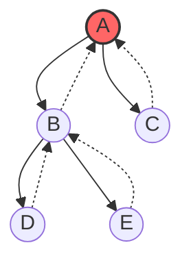

</td>
<td>

Fig. 2 - Identificação do antecessor
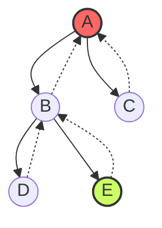

</td>
</tr>

<tr>
<td>

Fig. 3 - Transposição do antecessor com o nó a ser removido
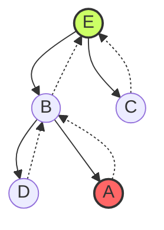

</td>
<td>

Fig. 4 - Remoção do nó folha
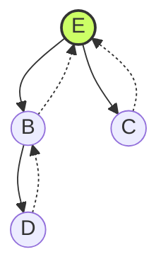

</td>
</tr>
</table>

---

<h5> 2. Remoção de um nó com antecessor</h5>

<table>
<tr>
<td>

Fig. 1 - Identificação do nó a ser removido
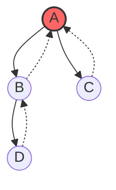

</td>
<td>

Fig. 2 - Identificação do antecessor
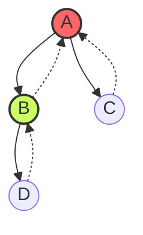

</td>
</tr>

<tr>
<td>

Fig. 3 - Transposição do antecessor com o nó a ser removido
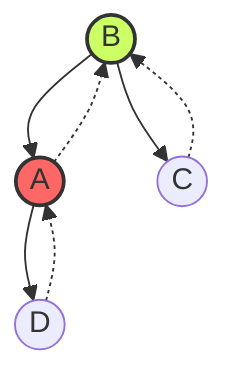

</td>
<td>

Fig. 4 - Remoção do nó com um filho
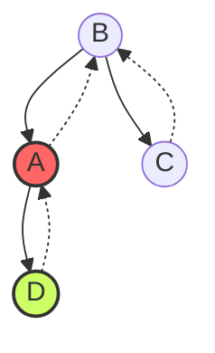

</td>
</tr>


<tr>
<td>

Fig. 5 - Transposição do nó a ser removido com o único filho
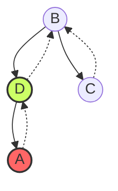

</td>
<td>

Fig. 6 - Remover uma folha
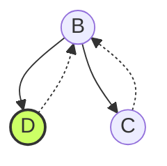

</td>
</tr>
</table>


<h5> 3. Remoção de um nó sem antecessor</h5>

<table>
<tr>
<td>

Fig. 1 - Identificação do nó a ser removido
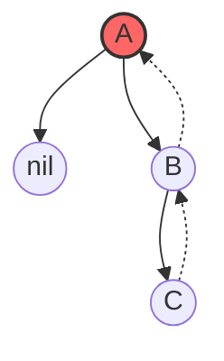

</td>
<td>

Fig. 2 - Identificação do sucessor


</td>
</tr>

<tr>
<td>

Fig. 3 - Transposição do sucessor com o nó a ser removido


</td>

</tr>
</table>


