## Remoções na Árvore Binária

<h3> Cenário 1 - Remoção de uma folha </h3>

<table border="1px"> 
<tr>
<td>

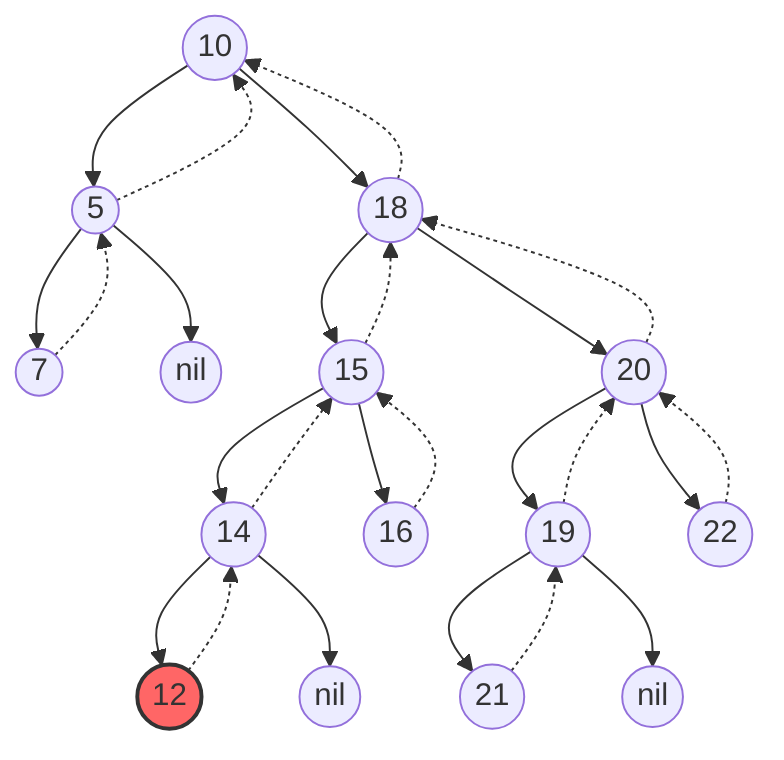
Fig 1. Procurando o nó que deve ser removido ("12").

</td>

<td>

```mermaid
graph TD

idx10((10))
idx5((5))
idx7((7))
idxNull1((nil))
idxNull2((nil))
idxNull3((nil))
idxNull4((nil))
idx18((18))
idx15((15))
idx20((20))
idx14((14))
idx16((16))
idx19((19))
idx12((12))
idx22((22))
idx21((21))

idx10--> idx5
idx10--> idx18
idx5--> idx7
idx5--> idxNull1((nil))
idx18--> idx15
idx18--> idx20
idx15--> idx14
idx14 --> idxNull2
idx14--> idxNull4
idx15--> idx16
idx20--> idx19
idx19--> idx21
idx19--> idxNull3
idx20--> idx22

idx5 -.-> idx10
idx7 -.-> idx5
idx18 -.-> idx10
idx15 -.-> idx18
idx20 -.-> idx18
idx14 -.-> idx15
idx16 -.-> idx15
idx19 -.-> idx20
idx12 -.-> idx14
idx21 -.-> idx19
idx22 -.-> idx20

style idx12 fill:#FF6666,stroke:#333,stroke-width:2px
style idxNull2 fill:#CCFF66,stroke:#333,stroke-width:2px
style idx14 fill:#000033,stroke:#333,stroke-width:2px
```
Fig 2. Como o nó a ser removido ("12") é uma folha, o pai ("14")  apontará para nulo ("nil").

</td>

<td>

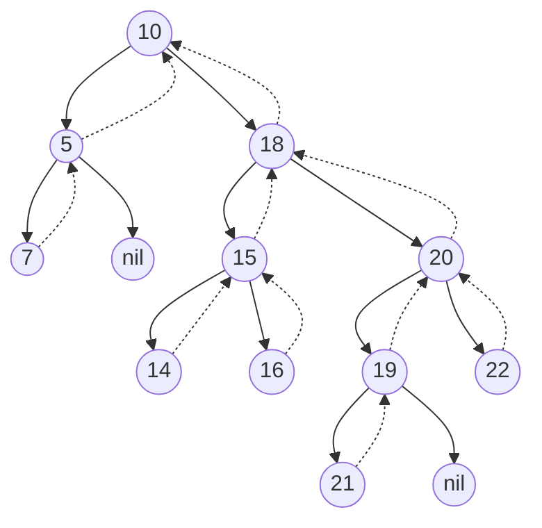
Fig 3. Nó removido.

</td>

</tr>
</table>

---

<h3> Cenário 2 - Remoção de um nó interno com um único filho</h3>

<table border="1px"> 
<tr>
<td>

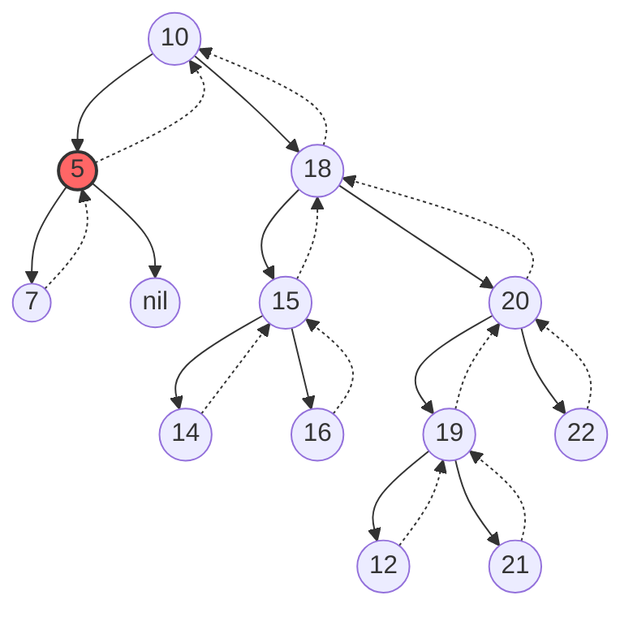
Fig 1. Procurando o nó que deve ser removido ("5").

</td>

<td>

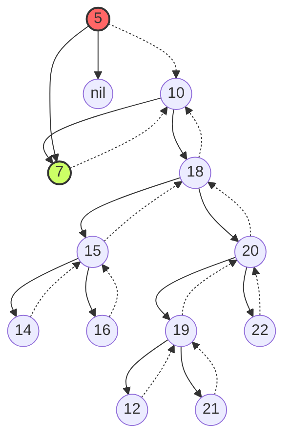
Fig 2. Como o nó a ser removido tem um único filho,
 então, transposição da sub-árvore ("7") com o 
 nó a ser removido ("5").

</td>

<td>

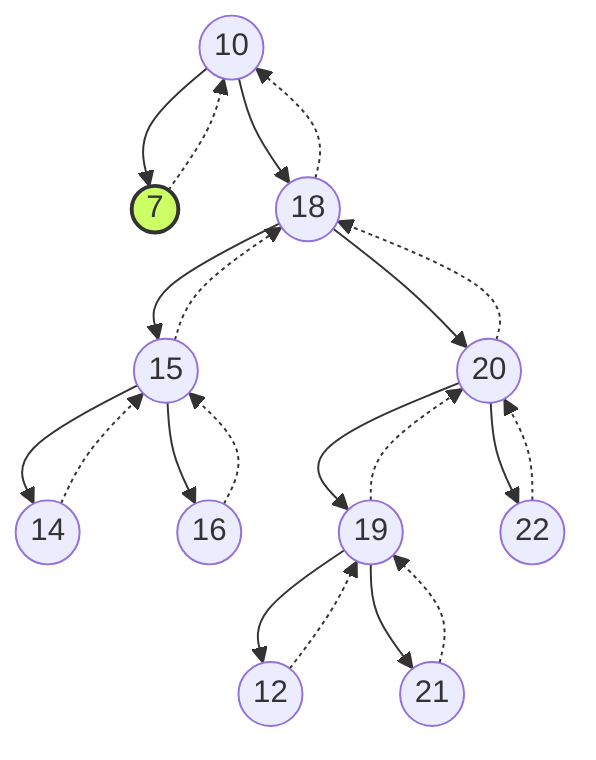
Fig 3. Nó removido ("5").

</td>

</tr>
</table>

---

<h3> Cenário 3 - Remoção de um nó com dois filhos </h3>

<table border="1px"> 
<tr>
<td>

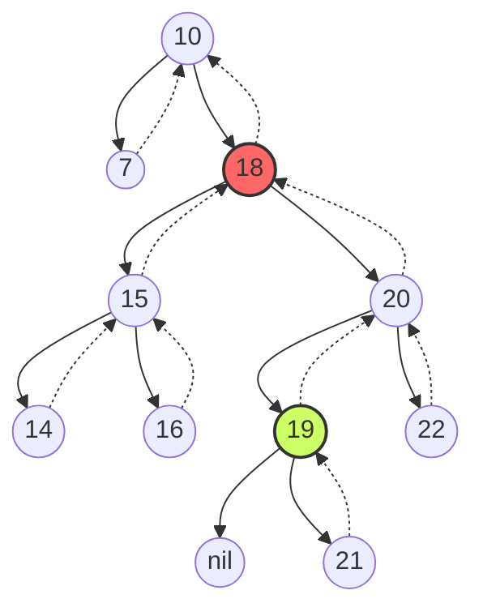
Fig 1. Procurando o nó a ser removido ("18"), e, como o esse nó possui dois filhos, deve-se identificar o nó sucessor ("19").

</td>
<td>

```mermaid
graph TD

idx10((10))
idx7((7))
idx18((18))
idx15((15))
idx20((20))
idx14((14))
idx16((16))
idx21((21))
idx19((19))
idxNull((nil))
idx22((22))

idx10--> idx7
idx10--> idx18
idx18--> idx15
idx18--> idx20
idx15--> idx14
idx15--> idx16
idx19 --esq--> idxNull
idx19 --dir--> idx21
idx20--> idx21
idx20--> idx22

idx7 -.-> idx10
idx18 -.-> idx10
idx15 -.-> idx18
idx20 -.-> idx18
idx14 -.-> idx15
idx16 -.-> idx15
idx19 -.-> idx20
idx21 -.-> idx20
idx22 -.-> idx20

style idx18 fill:#FF6666,stroke:#333,stroke-width:2px
style idx19 fill:#CCFF66,stroke:#333,stroke-width:2px
style idx21 fill:#000033,stroke:#333,stroke-width:2px
```

Fig 2. O sucessor ("19") possui um filho, logo, realizar a transposição do sucessor com o seu único filho ("21").

</td>

<td>

```mermaid
graph TD

idx10((10))
idx7((7))
idx18((18))
idx15((15))
idx20((20))
idx14((14))
idx16((16))
idx19((19))
idx21((21))
idxNull((nil))
idx22((22))

idx10--> idx7
idx7 -.-> idx10
idx10--> idx18
idx18 -.-> idx10
idx18--> idx15
idx15 -.-> idx18
idx18--> idx20
idx15--> idx14
idx14 -.-> idx15
idx15--> idx16
idx16 -.-> idx15
idx19--esq--> idxNull
idx19--dir--> idx20
idx20 -.-> idx19
idx19 -.-> idx20
idx20--> idx21
idx21 -.-> idx20
idx20--> idx22
idx22 -.-> idx20

style idx18 fill:#FF6666,stroke:#333,stroke-width:2px
style idx19 fill:#CCFF66,stroke:#333,stroke-width:2px
style idx20 fill:#000033,stroke:#333,stroke-width:2px
```

Fig 3. Ajustando o filho da direita do sucessor ("19") e pai do filho da direita ("20") do nó a ser removido ("18").

</td>
</tr>

<tr>
<td>

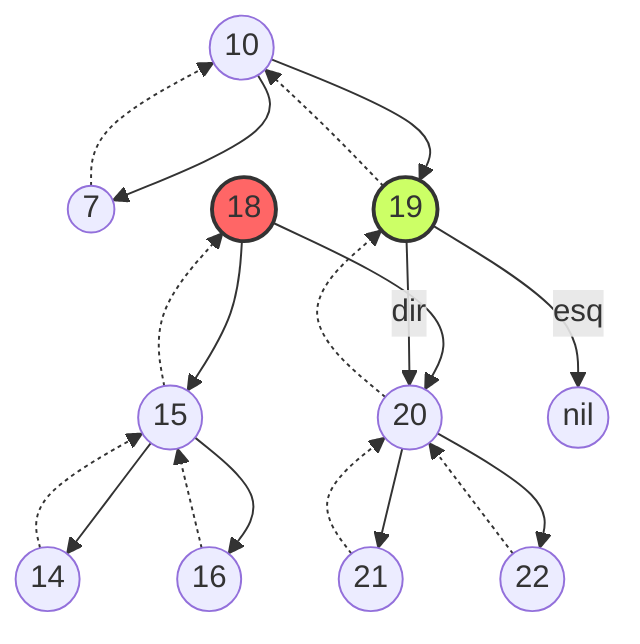

Fig 4. Transposição do nó a ser removido ("18") com o seu sucessor ("19").

</td>
<td>

```mermaid
graph TD

idx10((10))
idx7((7))
idx18((18))
idx15((15))
idx19((19))
idx20((20))
idx14((14))
idx16((16))
idx21((21))
idx22((22))

idx10--> idx7
idx18--> idx15
idx18--> idx20
idx15--> idx14
idx15--> idx16
idx10--> idx19
idx19--esq--> idx15
idx19--dir--> idx20
idx20--> idx21
idx20--> idx22

idx7 -.-> idx10
idx15 -.-> idx19
idx14 -.-> idx15
idx16 -.-> idx15
idx19 -.-> idx10
idx20 -.-> idx19
idx21 -.-> idx20
idx22 -.-> idx20

style idx18 fill:#FF6666,stroke:#333,stroke-width:2px
style idx19 fill:#CCFF66,stroke:#333,stroke-width:2px
style idx15 fill:#000033,stroke:#333,stroke-width:2px
```

Fig 5. Ajustando o filho da esquerda do sucessor ("19") e o pai do filho da esquerda ("15") do nó a ser removido ("18").

</td>
<td>

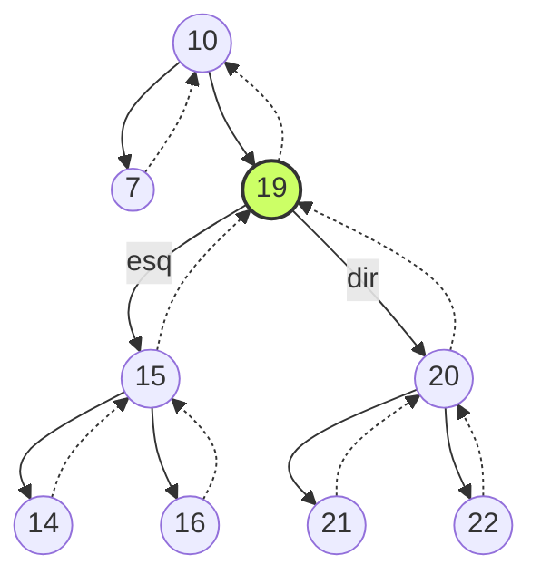

Fig 6. Remoção do nó da memória.

</td>

</tr>

</table>