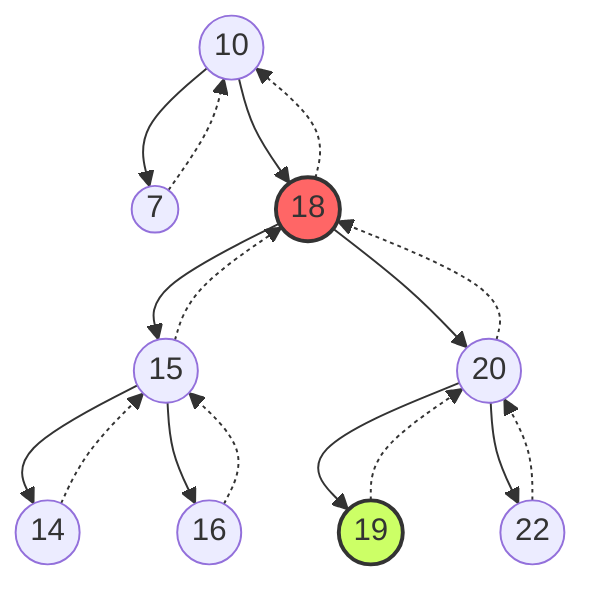

## Árvore Original



1. Identificando o sucessor
```java
arvore_a.remover(18);
no <- arvore_a.buscar(18);
arvore_a.remover(no);
no_sucessor <- idx18.sucessor(no);
```

2. Realizando a transposição

```java

```